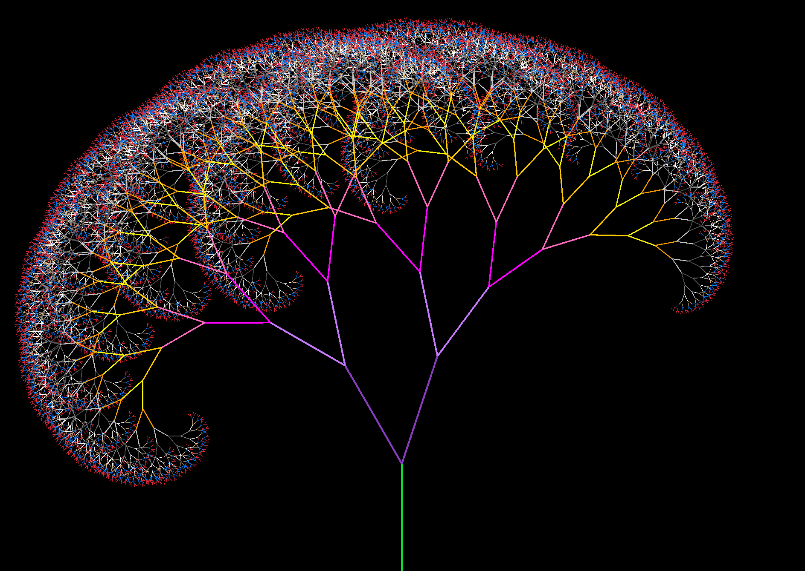

#  Recursion Tree (C# + Raylib)

This small program draws a **recursive tree** using **Raylib** and **C#**.  
It demonstrates how recursion can be used to create natural, self-similar structures with very little code.

---

##  Purpose

The goal of this project is to **visualize recursion** in a simple and intuitive way —  
each branch of the tree calls itself to draw two smaller branches, forming a fractal-like structure.

---

##  How it works

- **Raylib** is used for all rendering.  
- The tree starts from a single root point and branches recursively.  
- A few parameters control its overall look:

| Variable | Description |
|-----------|--------------|
| `maxDepth` | How many recursive levels are drawn (tree complexity). |
| `length` | Starting branch length, which shortens each step. |
| `angle` | The base branching angle (in radians). |
| `variations[]` | A float array that slightly changes the angle at each recursion level to make the tree more organic. |

---

##  Example Output



---

##  Notes

- Written entirely in **C#** using the **Raylib_cs** bindings.  
- No external assets or frameworks needed.  
- A good example to understand recursive drawing and procedural generation basics.

---

##  Run

Make sure you have **Raylib_cs** installed, 
```bash 
dotnet add package Raylib-cs
``` 

then compile and run:

```bash
dotnet run
